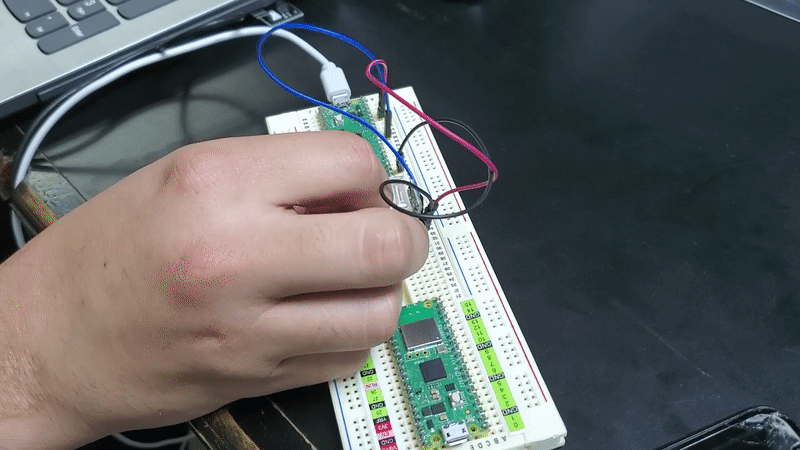

Si el sensor es sometido a alguna vibracion, los dos pines de salida son cortocircuiteados.

En este ejemplo el led de la pi pico es encendido al momento que el sensor recibe una vibracion.

*(Sin vibrar / led apagado)*

*(Vibrando / led encendido)*
